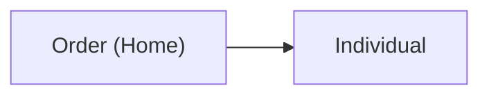

# data360-autodoc

[](https://pypi.org/project/data360-autodoc/)
[](#)
[](LICENSE)

**Auto-generate human-readable documentation for Salesforce Data 360 (Data Cloud) orgs — in seconds, not days.**

Point it at an org and it produces a full data dictionary (DMOs, DLOs, fields, keys), an ERD of your DLO → DMO mappings, and a deterministic JSON snapshot.

- 📓 **Data dictionary** — every DMO, DLO, Calculated Insight, and Identity Resolution ruleset as clean Markdown tables.
- 🔗 **ERD diagram** — a Mermaid `graph LR` of how your Data Lake Objects map into Data Model Objects.
- 🧊 **JSON snapshot** — a deterministic, diff-friendly export of your whole org schema (the foundation for drift detection — see below).

## For who

Built for **Salesforce SI consultants and Data Cloud practitioners** who lose days hand-writing org documentation for every engagement. Works against any Data 360 org you can authenticate to with a connected app — including **Developer Edition / Data Cloud Dev orgs**, so you can try it on a sandbox before pointing it at a client.

## Quick start

```bash
pip install data360-autodoc

data360-autodoc generate \
  --instance-url https://mydomain.my.salesforce.com \
  --client-id <connected-app-consumer-key> \
  --private-key ./server.pem \
  --username admin@myorg.com \
  --output ./docs \
  --format all
```

```
Wrote acme-data-cloud.md
Wrote acme-data-cloud.mmd
Wrote acme-data-cloud.json
Generated docs for 12 DMOs, 8 DLOs, 3 Identity Rulesets
```

Authentication uses the **OAuth 2.0 JWT Bearer flow** (connected app + private key — no passwords stored). Add `--sandbox` for sandbox / scratch orgs.

## What you get

`--format` controls the output:

| Format | Files | What it is |
|--------|-------|------------|
| `markdown` | `.md` + `.mmd` | Data dictionary + Mermaid ERD |
| `json` | `.json` | Deterministic org-schema snapshot |
| `pdf` | — | _Coming soon_ |
| `all` | all of the above | Everything |

### Example output

The Markdown data dictionary:

```markdown
## Data Lake Objects (DLOs)

### Order (Home) (`Order_Home__dll`)

| Name | Type | Key |
| --- | --- | --- |
| Amount | Number |  |
| OrderId | Text | PrimaryKey |
```

The ERD (renders natively in GitHub):



Output is **deterministic** — the same org always produces byte-identical docs (collections are sorted alphabetically). That makes the output safe to commit and easy to diff.

## Future: drift monitoring (paid tier)

The open-source CLI documents your org once. The thing that actually bites consultants is when an org **changes** after you've documented it — a client admin adds a DLO, a field type changes, an identity rule shifts — and your beautiful docs quietly go stale.

A hosted tier (planned) will turn the deterministic JSON snapshot into **drift monitoring**: re-run on a schedule, diff today's snapshot against the last one, and get a client-ready changelog of exactly what changed — without ever handing over your org credentials (drift runs in your own environment; the hosted service only stores snapshots and sends alerts). The CLI stays free forever; the recurring watching, history, and multi-org dashboard are the paid layer.

## Hosted version

A hosted web UI is in the works at **[data360doc.com](https://data360doc.com)** _(placeholder)_ — same docs, plus scheduled drift alerts and a multi-org dashboard for agencies.

## License

MIT
