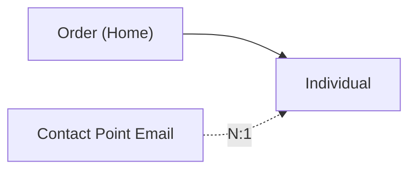

# data360-autodoc

[](https://pypi.org/project/data360-autodoc/)
[](https://pypi.org/project/data360-autodoc/)
[](#)
[](LICENSE)

**Auto-generate human-readable documentation for Salesforce Data 360 (Data Cloud) orgs — in seconds, not days.**

Point it at an org and it produces a full data dictionary (DMOs, DLOs, fields, keys), the data streams and field-level mappings behind them, the DMO relationship graph, an ERD, and a deterministic JSON snapshot.

- 📓 **Data dictionary** — every DMO and DLO as clean Markdown tables, with field names, types, and keys.
- 🌊 **Data streams + field mappings** — per-stream source/refresh metadata, the Stream → DLO field map, and the DLO → DMO field map (with real labels, not just API names).
- 🔗 **Relationships + ERD** — DMO-to-DMO relationships with cardinality and status, plus a Mermaid graph of DLO → DMO mappings and relationship edges.
- 🧊 **JSON snapshot** — a deterministic, diff-friendly export of your whole org schema (the foundation for drift detection — see below).

## For who

Built for **Salesforce SI consultants and Data Cloud practitioners** who lose days hand-writing org documentation for every engagement. It works against any Data 360 org you can authenticate to with a connected app, and is **tested against Developer Edition / Data Cloud dev orgs** — try it on a sandbox before pointing it at a client. If your org has a shape it doesn't handle yet, [open an issue](https://github.com/valentinatihova/data360-autodoc/issues) and it gets fixed.

## Quick start

```bash
pip install data360-autodoc

data360-autodoc generate \
  --instance-url https://mydomain.my.salesforce.com \
  --client-id <connected-app-consumer-key> \
  --private-key ./server.pem \
  --username admin@myorg.com \
  --output ./docs \
  --format all
```

```
Wrote acme-data-cloud.md
Wrote acme-data-cloud.mmd
Wrote acme-data-cloud.json
Generated docs for 24 DMOs, 11 DLOs, 0 Identity Rulesets
```

Authentication uses the **OAuth 2.0 JWT Bearer flow** (connected app + private key — no passwords stored).

**Options that affect the metadata fetch:**

- `--sandbox` — authenticate against `test.salesforce.com` (sandbox / scratch orgs).
- `--api-version` — the Salesforce REST API version used for the `/ssot/*` metadata calls (e.g. `v62.0`). **By default the tool auto-detects your org's highest supported version** (from `GET /services/data/`), so you normally don't set this. Force it only if auto-detection picks a version where a Data Cloud endpoint misbehaves, or to pin output to a specific version. It must be a valid Salesforce REST API version your org supports.

(The `Identity Rulesets` count is currently always `0` — see "Not supported yet" below.)

## What you get

`--format` controls the output:

| Format | Files | What it is |
|--------|-------|------------|
| `markdown` | `.md` + `.mmd` | Data dictionary + Mermaid ERD |
| `json` | `.json` | Deterministic org-schema snapshot |
| `pdf` | — | _Coming soon_ |
| `all` | all of the above | Everything |

### Example output

The Markdown data dictionary. DMO field types come from the org's relationships metadata, and fall back to the mapped DLO field type when the DMO endpoint returns a generic type (shown as `(via DLO)`); DLO keys come from the data streams:

```markdown
## Data Model Objects (DMOs)

### Individual (`Individual__dmo`)

| Name | Type | Key |
| --- | --- | --- |
| Email__c | EmailAddress |  |
| Id__c | Text |  |

## Data Lake Objects (DLOs)

### Order (Home) (`Order_Home__dll`)

| Name | Type | Key |
| --- | --- | --- |
| Amount | Number |  |
| OrderId | Text | PrimaryKey |
```

Beyond the dictionary, the document includes (in this order):

- **Data Streams** — one row per stream: data source, category, primary key, schedule, refresh mode.
- **Field Mapping (Streams → DLO)** — every Data Lake field with its source field, DLO label, type, and a `KQ_`-prefix foreign-key flag.
- **DLO → DMO Field Mappings** — field-level source → target mappings, grouped by DLO → DMO pairing, with real labels joined from DLO metadata.
- **Relationships** — DMO-to-DMO links with cardinality and status (inactive standard relationships stay visible, never dropped):

```markdown
## Relationships

| Object | Field | Cardinality | Related Object | Related Field | Status |
| --- | --- | --- | --- | --- | --- |
| Account | ssot__PrimarySalesContactPointId__c | N:1 | ssot__ContactPointEmail__dlm | ssot__Id__c | INACTIVE |
```

The ERD (renders natively in GitHub). Solid arrows are DLO → DMO mappings; dashed, cardinality-labeled arrows are active DMO → DMO relationships:



Output is **deterministic** — the same org always produces byte-identical docs (collections are sorted alphabetically). That makes the output safe to commit and easy to diff.

### What it reads — and what it doesn't yet

Under the hood it calls the **Data 360 Connect REST API** (`/services/data/v…/ssot/*`): `data-model-objects` (DMOs), `data-model-object-mappings` (DLO→DMO mappings + field names), `…/{dmo}/relationships` (DMO field types **and** the DMO-to-DMO relationship graph), and `data-streams` (DLOs + their fields + the per-stream and field-level mappings, including primary keys). Full request/response shapes are in [`agent_docs/api_reference.md`](agent_docs/api_reference.md).

**Not supported yet.** Calculated Insights and Identity Resolution rulesets are **not fetched** — those sections render as empty placeholders (e.g. `_No Calculated Insights found._`) and the `Identity Rulesets` count stays `0`. Documenting them is on the roadmap. (Profile and Engagement DMOs *are* covered — those are DMO categories, not separate entities.)

**Resilient by default.** If one DMO's metadata can't be read, that DMO is skipped with a warning and the rest of the document is still produced. If the org has more than 500 DMOs, the list is capped (with a warning). A failure fetching the DMO list or the data streams stops the run with a clean one-line error — never a stack trace.

## Future: drift monitoring (paid tier)

The open-source CLI documents your org once. The thing that actually bites consultants is when an org **changes** after you've documented it — a client admin adds a DLO, a field type changes, an identity rule shifts — and your beautiful docs quietly go stale.

A hosted tier (planned) will turn the deterministic JSON snapshot into **drift monitoring**: re-run on a schedule, diff today's snapshot against the last one, and get a client-ready changelog of exactly what changed — without ever handing over your org credentials (drift runs in your own environment; the hosted service only stores snapshots and sends alerts). The CLI stays free forever; the recurring watching, history, and multi-org dashboard are the paid layer.

## Hosted version

A hosted web UI is in the works at **[data360doc.com](https://data360doc.com)** _(placeholder)_ — same docs, plus scheduled drift alerts and a multi-org dashboard for agencies.

## License

MIT
